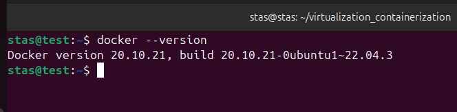

# Домашнее задание к занятию "`Введение в виртуализацию`" - `Кутейкин Станислав`

**ЗДРАВСТВУЙТЕ!**

---

## Задание 1

---

---

## Задание 2

высоконагруженная база данных MySql, критичная к отказу - можно использовать и паравиртуализацию и физические сервера, только не контейнеризацию(очень желательно), потому что ВМ позволяют создать достаточно отказоустойчивости, что и требуется для БД, но все же лучше использовать физические сервера.  

различные web-приложения - виртуализация уровня ОС, вообще не критично запускать их в контейнерах, очень легко будет их масштабировать и добиться достаточной отказоустойчивости для них.  

Windows-системы для использования бухгалтерским отделом - для них будет достаточно и паравиртуализации, можно также и контейнеризацию, не столь критичные системы это.  

системы, выполняющие высокопроизводительные расчёты на GPU - а вот тут лучше использовать только физические сервера, так как требуется максимальная отдача от железа.  

---

---

## Задание 3

100 виртуальных машин на базе Linux и Windows, общие задачи, нет особых требований. Преимущественно Windows based-инфраструктура, требуется реализация программных балансировщиков нагрузки, репликации данных и автоматизированного механизма создания резервных копий. - тут я думаю будет достаточно VMWare VSphere  

Требуется наиболее производительное бесплатное open source-решение для виртуализации небольшой (20-30 серверов) инфраструктуры на базе Linux и Windows виртуальных машин. - так как open source то я думаю Xen подойдет  

Необходимо бесплатное, максимально совместимое и производительное решение для виртуализации Windows-инфраструктуры. - ну тут однозначно Microsoft Hyper-V  

Необходимо рабочее окружение для тестирования программного продукта на нескольких дистрибутивах Linux. - раз используем Linux то и берем их решения, KVM подойдет  

---

---

## Задание 4

Опишите возможные проблемы и недостатки гетерогенной среды виртуализации (использования нескольких систем управления виртуализацией одновременно) и что необходимо сделать для минимизации этих рисков и проблем. Если бы у вас был выбор, создавали бы вы гетерогенную среду или нет?  

Для минимизации рисков нужно как не странно использовать одну систему управления виртуализацией. Если бы был выбор, то нет, не использовал бы.

---

**СПАСИБО ЗА ПРОВЕРКУ!**
