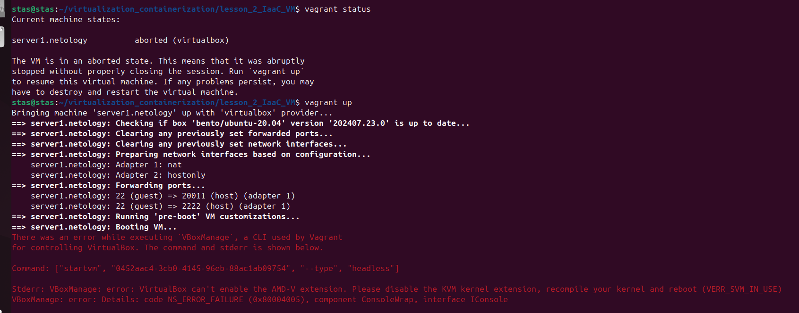

# Домашнее задание к занятию "`Применение принципов IaaC в работе с виртуальными машинами`" - `Кутейкин Станислав`

**ЗДРАВСТВУЙТЕ!**

---

Буду писать ответ для всего. C packer все получилось, скрипт есть. С vagrant не получилось, так как у меня ВМ уже установлена в virtualbox и еще раз просто не даст запустить в ВМ установку, скрин оишбки ниже:

---

**СПАСИБО ЗА ПРОВЕРКУ!**
